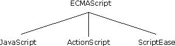
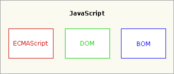

<!-- TOC -->

- [1. JavaScript简介](#1-javascript简介)
    - [1.1. 什么是 JavaScript](#11-什么是-javascript)
    - [1.2. JavaScript 特点](#12-javascript-特点)
        - [1.2.1. 松散性](#121-松散性)
        - [1.2.2. 对象属性](#122-对象属性)
        - [1.2.3. 继承机制](#123-继承机制)
    - [1.3. JavaScript 核心](#13-javascript-核心)
        - [1.3.1. 核心(ECMAScript)](#131-核心ecmascript)
        - [1.3.2. 文档对象模型(DOM)](#132-文档对象模型dom)
        - [1.3.3. 浏览器对象模型(BOM)](#133-浏览器对象模型bom)
    - [1.4. 总结](#14-总结)

<!-- /TOC -->

# 1. JavaScript简介

## 1.1. 什么是 JavaScript

JavaScript 是一种具有面向对象能力的、解释型的程序设计语言。更具体一点，它是基于对象和事件驱动并具有相对安全性的客户端脚本语言。 因为他不需要在一个语言环境下运行， 而只需要支持它的浏览器即可。 它的主要目的是：验证发往服务器端的数据、 增加 Web互动、加强用户体验度等。

## 1.2. JavaScript 特点

### 1.2.1. 松散性

JavaScript 语言核心与 C、C++、Java 相似，比如条件判断、循环、运算符等。但，它却是一种松散类型的语言，也就是说，它的变量不必具有一个明确的类型。

### 1.2.2. 对象属性

JavaScript 中的对象把属性名映射为任意的属性值。它的这种方式很像哈希表或关联数组，而不像 C 中的结构体或者 C++、Java 中的对象。

### 1.2.3. 继承机制
JavaScript 中的面向对象继承机制是基于原型的，这和另外一种不太为人所知的 Self 语言很像，而和 C++以及 Java 中的继承大不相同。

## 1.3. JavaScript 核心

### 1.3.1. 核心(ECMAScript)

描述了该语言的 **语法** 和 **基本对象** 。

ECMAScript 并不与任何具体浏览器相绑定，ECMAScript 可以为不同种类的宿主环境提供核心的脚本编程能力，因此核心的脚本语言是与任何特定的宿主环境分开进行规定的。

**宿主环境：**

* Web 浏览器
* Nombas 的 ScriptEase、 Macromedia
* 用在 Flash 和 Director MX 中的 ActionScript

**ECMAScript 描述了以下内容：**

* 语法
* 类型
* 语句
* 关键字
* 保留字
* 运算符
* 对象

ECMAScript 仅仅是一个描述，定义了脚本语言的所有属性、方法和对象。其他语言可以实现 ECMAScript 来作为功能的基准。

 
**ECMAScript第三版标志正ECMAScript成为一门真正的编程语言。**

### 1.3.2. 文档对象模型(DOM)

描述了处理网页内容的方法和接口。

DOM（文档对象模型）是 HTML 和 XML 的应用程序接口（API）。DOM 将把整个页面规划成由节点层级构成的文档。HTML 或 XML 页面的每个部分都是一个节点的衍生物。

**DOM 1级（DOM Level 1）--1998.10：**

两个模块组成：DOM核心（DOM Core）和DOM HTML

DOM核心：规定是如何映射给予XML的文档结构，简化对文档中任意部分的访问和操作。

DOM HTML：在DOM核心上进行扩展，添加针对HTML的对象和方法。

**DOM 2级（DOM Level 2）：**

在DOM1级的基础上增加了鼠标和用户界面事件、范围、遍历模块，新增对CSS的支持，支持XML命名空间。

DOM视图（DOM Views）：定义了跟踪不同文档（例如：应用CSS之前和之后的文档）视图的接口。

DOM事件（DOM Events）：定义了事件和事件处理的接口。

DOM样式（DOM Style）：定义了基于CSS为元素应用样式的接口。

DOM遍历和范围（DOM Traversal and Range）：定义了遍历和操作文档树的接口。

**DOM 3级（DOM Level 3）：**

DOM加载和保存模块（DOM Load and Save）：统一加载和保存文档的方法。

DOM验证模块（DOM Validation）：验证文档的方法。

DOM3级也对DOM核心进行扩展，开始支持XML 1.0规范，涉及XML Infoset、XPath、XML Base。

### 1.3.3. 浏览器对象模型(BOM)

描述了与浏览器进行交互的方法和接口。

BOM（浏览器对象模型），可以对浏览器窗口进行访问和操作。使用 BOM，开发者可以移动窗口、改变状态栏中的文本以及执行其他与页面内容不直接相关的动作。

 

## 1.4. 总结

* JavaScript 是一种专为网页交互而设计的浏览器脚本语言。
* JavaScript = ECMAScript + DOM +BOM。