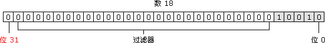
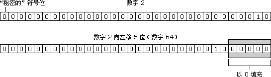
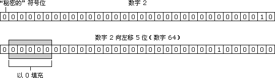

<!-- TOC -->

- [1. 操作符](#1-操作符)
    - [1.1. 一元操作符](#11-一元操作符)
        - [1.1.1. 递增和递减操作符](#111-递增和递减操作符)
        - [1.1.2. 一元加减运算符](#112-一元加减运算符)
        - [1.1.3. delete运算符](#113-delete运算符)
        - [1.1.4. void运算符](#114-void运算符)
    - [1.2. 位操作符](#12-位操作符)
        - [1.2.1. 按位非（NOT）](#121-按位非not)
        - [1.2.2. 按位与（AND）](#122-按位与and)
        - [1.2.3. 按位或（OR）](#123-按位或or)
        - [1.2.4. 按位异或（XOR）](#124-按位异或xor)
        - [1.2.5. 左移](#125-左移)
        - [1.2.6. 有符号右移](#126-有符号右移)
        - [1.2.7. 无符号右移](#127-无符号右移)
    - [1.3. 逻辑操作符](#13-逻辑操作符)
        - [1.3.1. 逻辑非（!）](#131-逻辑非)
        - [1.3.2. 逻辑与（&&）](#132-逻辑与)
        - [1.3.3. 逻辑或（||）](#133-逻辑或)
    - [1.4. 乘性操作符](#14-乘性操作符)
        - [1.4.1. 乘法操作符](#141-乘法操作符)
        - [1.4.2. 除法操作符](#142-除法操作符)
        - [1.4.3. 取模运算符](#143-取模运算符)
    - [1.5. 加性操作符](#15-加性操作符)
        - [1.5.1. 加法操作符](#151-加法操作符)
        - [1.5.2. 减法操作符](#152-减法操作符)
    - [1.6. 关系操作符](#16-关系操作符)
    - [1.7. 相等操作符](#17-相等操作符)
        - [1.7.1. 相等于不相等（==、!=）](#171-相等于不相等)
        - [1.7.2. 全等与不全等（===、!==）](#172-全等与不全等)
    - [1.8. 条件操作符(三元运算符)](#18-条件操作符三元运算符)
    - [1.9. 赋值操作符](#19-赋值操作符)
    - [1.10. 逗号操作符](#110-逗号操作符)

<!-- /TOC -->

<a id="markdown-1-操作符" name="1-操作符"></a>
# 1. 操作符

<a id="markdown-11-一元操作符" name="11-一元操作符"></a>
## 1.1. 一元操作符

只能操作一个值的运算符叫做 `一元运算符` 。

<a id="markdown-111-递增和递减操作符" name="111-递增和递减操作符"></a>
### 1.1.1. 递增和递减操作符

递增和递减运算符有 `前置递增`、`后置递增`、`前置递减`、`后置递减`。

在没有赋值操作，前置和后置是一样的。但在赋值操作时，如果递增或递减运算符前置，那么前置的运算符会先累加或累减再赋值，如果是后置运算符则先赋值再累加或累减。

使用规则：

1. 包含有效数字字符的字符串递增递减，先将其转换成数字值，再执行相应的操作。
1. 不包含有效数字字符的字符串递增递减，结果为NaN。
1. 布尔值递增递减，先将布尔值转换成0和1，再执行相应的操作。
1. 应用与浮点数值时，执行加减1操作。
1. 运用与对象时，调用对象的 `valueOf()`、`toString()`方法后，按上述规则执行相应的操作。

```javascript
var i = 10;
console.log(i++ + i++ + i++);   //33
console.log(i);                 //13

var i = 10;
console.log(++i + ++i + ++i);   //36
console.log(i);                 //13

```

<a id="markdown-112-一元加减运算符" name="112-一元加减运算符"></a>
### 1.1.2. 一元加减运算符

作用：

1. 改变数值的正负。
2. 运用于非数值前，执行 `Number()` 相同的功能，将其转换成数值。

<a id="markdown-113-delete运算符" name="113-delete运算符"></a>
### 1.1.3. delete运算符

`delete` 运算符删除对以前定义的对象属性或方法的引用。

```javascript
var o = new Object;
o.name = "David";
alert(o.name);	//输出 "David"
delete o.name;
alert(o.name);	//输出 "undefined"
```	

`delete` 运算符不能删除开发者未定义的属性和方法。

```javascript
delete o.toString;	//引发错误
```

即使 toString 是有效的方法名，这行代码也会引发错误，因为 `toString()` 方法是原始的 ECMAScript 方法，不是开发者定义的。

<a id="markdown-114-void运算符" name="114-void运算符"></a>
### 1.1.4. void运算符

void 运算符对任何值返回 undefined。该运算符通常用于避免输出不应该输出的值。

例如，从 HTML 的 `<a>` 元素调用 JavaScript 函数时。要正确做到这一点，函数不能返回有效值，否则浏览器将清空页面，只显示函数的结果。

```javascript
<a href="javascript:window.open('about:blank')">Click me</a>
```

如果把这行代码放入 HTML 页面，点击其中的链接，即可看到屏幕上显示 "[object]"。

这是因为 window.open() 方法返回了新打开的窗口的引用。然后该对象将被转换成要显示的字符串。

要避免这种效果，可以用 void 运算符调用 window.open() 函数：

```javascript
<a href="javascript:void(window.open('about:blank'))">Click me</a>
```

这使 window.open() 调用返回 undefined，它不是有效值，不会显示在浏览器窗口中。

**注意：没有返回值的函数真正返回的都是 undefined。**

<a id="markdown-12-位操作符" name="12-位操作符"></a>
## 1.2. 位操作符

ECMAScript 中所有的数字都是按 `64位格式` 存放的，但位操作符不直接操作64位的数值。而是先将64为数值转换成32位数值，然后再执行操作，最后再将结果转换回64位。

ECMAScript 整数有两种类型，即有 `符号整数`（允许用正数和负数）和 `无符号整数`（只允许用正数）。在 ECMAScript 中，所有整数字面量默认都是有符号整数。

有符号整数使用 31 位表示整数的数值，用第 32 位表示整数的符号，0 表示正数，1 表示负数。数值范围从 `-2147483648` 到 `2147483647`。

可以以两种不同的方式存储二进制形式的有符号整数，一种用于存储正数，一种用于存储负数。正数是以真二进制形式存储的，前 31 位中的每一位都表示 2 的幂，从第 1 位（位 0）开始，表示 2^0，第 2 位（位 1）表示 2^1。没用到的位用 0 填充，即忽略不计。例如，下图展示的是数 18 的表示法。



负数也存储为二进制代码，不过采用的形式是二进制补码。计算数字二进制补码的步骤有三步：

1.	确定该数字的非负版本的二进制表示。
1.	求得二进制反码，即要把 0 替换为 1，把 1 替换为 0。
1.	在二进制反码上加 1。

注意：`NaN` 和 `Infinity` 应用位操作时，这两个值会被当做0来处理。

<a id="markdown-121-按位非not" name="121-按位非not"></a>
### 1.2.1. 按位非（NOT）

位运算 `NOT` 由否定号（`~`）表示，它是 ECMAScript 中为数不多的与二进制算术有关的运算符之一。

位运算 NOT 是三步的处理过程：

1. 把运算数转换成 32 位数字
1. 把二进制数转换成它的二进制反码
1. 把二进制数转换成浮点数

按位非的操作的本质：操作数的负数减一。

<a id="markdown-122-按位与and" name="122-按位与and"></a>
### 1.2.2. 按位与（AND）

位运算 `AND` 由和号（`&`）表示，直接对数字的二进制形式进行运算。它把每个数字中的数位对齐，然后用下面的规则对同一位置上的两个数位进行 AND 运算。

第一个数字中的数位 | 第二个数字中的数位 | 结果
:----------:|:-----------:|:---:
1 | 1 | 1
1 | 0 | 0
0 | 1 | 0
0 | 0 | 0

<a id="markdown-123-按位或or" name="123-按位或or"></a>
### 1.2.3. 按位或（OR）

位运算 `OR` 由符号（`|`）表示，也是直接对数字的二进制形式进行运算。在计算每位时，OR 运算符采用下列规则：

第一个数字中的数位 | 第二个数字中的数位 | 结果
:----------:|:-----------:|:---:
1 | 1 | 1
1 | 0 | 1
0 | 1 | 1
0 | 0 | 0

<a id="markdown-124-按位异或xor" name="124-按位异或xor"></a>
### 1.2.4. 按位异或（XOR）

位运算 `XOR` 由符号（`^`）表示，当然，也是直接对二进制形式进行运算。XOR 不同于 OR，当只有一个数位存放的是 1 时，它才返回 1。真值表如下：

第一个数字中的数位 | 第二个数字中的数位 | 结果
:----------:|:-----------:|:---:
1 | 1 | 0
1 | 0 | 1
0 | 1 | 1
0 | 0 | 0

<a id="markdown-125-左移" name="125-左移"></a>
### 1.2.5. 左移

左移运算由两个小于号表示（`<<`）。它把数字中的所有数位向左移动指定的数量。

例如，把数字 2（等于二进制中的 10）左移 5 位，结果为 64。


 
注意：左移运算保留数字的符号位。

<a id="markdown-126-有符号右移" name="126-有符号右移"></a>
### 1.2.6. 有符号右移

有符号右移运算符由两个大于号表示（`>>`）。它把 32 位数字中的所有数位整体右移，同时保留该数的符号（正号或负号）。有符号右移运算符恰好与左移运算相反。

例如，把 64 右移 5 位，将变为 2：


 
<a id="markdown-127-无符号右移" name="127-无符号右移"></a>
### 1.2.7. 无符号右移

无符号右移运算符由三个大于号（`>>>`）表示，它将无符号 32 位数的所有数位整体右移。

对于正数，无符号右移运算的结果与有符号右移运算一样。负数无符号右移之后会得到正数。

<a id="markdown-13-逻辑操作符" name="13-逻辑操作符"></a>
## 1.3. 逻辑操作符

<a id="markdown-131-逻辑非" name="131-逻辑非"></a>
### 1.3.1. 逻辑非（!）

逻辑非运算符可以用于任何值。无论这个值是什么数据类型，这个运算符都会返回一个布尔值。它的流程是：先将这个值转换成布尔值，然后取反，规则如下：

1. 操作数是一个`对象`，返回 `false`；
1. 操作数是一个`空字符串`，返回 `true`；
1. 操作数是一个`非空字符串`，返回 `false`；
1. 操作数是数值 `0`，返回 `true`；
1. 操作数是任意`非 0 数值`(包括 `Infinity`)，返回 `false`；
1. 操作数是 `null`，返回 `true`；
1. 操作数是 `NaN`，返回 `true`；
1. 操作数是 `undefined`，返回 `true`；

<a id="markdown-132-逻辑与" name="132-逻辑与"></a>
### 1.3.2. 逻辑与（&&）

逻辑与运算规则：

第一个操作数 | 第二个操作数 | 结果
:-------:|:--------:|:---:
true | true | true
true | false | false
false | true | false
false | false | false

如果两边的操作数有一个操作数不是布尔值的情况下，与运算就不一定返回布尔值，此时，遵循以下规则：

1. 第一个操作数是对象，则返回第二个操作数；
1. 第二个操作数是对象，则第一个操作数返回 true，才返回第二个操作数，否则返回 false;
1. 如果两个操作数都是对象，则返回第二个操作数。
1. 有一个操作数是 null，则返回 null；**【若第一个操作数是false，则返回false】**
1. 有一个操作数是 undefined，则返回 undefined。**【若第一个操作数是false，则返回false】**
1. 如果有一个操作数是NaN则返回NaN。**【若第一个操作数是false，则返回false】**
 
**&&是短路运算符，第一个操作数能决定结果则不会对第二个操作数求值。**

<a id="markdown-133-逻辑或" name="133-逻辑或"></a>
### 1.3.3. 逻辑或（||）

逻辑或运算规则如下：

第一个操作数 | 第二个操作数 | 结果
:-------:|:--------:|:---:
true | true | true
true | false | true
false | true | true
false | false | false

如果两边的操作数有一个操作数不是布尔值的情况下，逻辑与运算就不一定返回布尔值，此时，遵循已下规则：

1. 第一个操作数是对象，则返回第一个操作数；
1. 第一个操作数的求值结果为 false，则返回第二个操作数；
1. 两个操作数都是对象，则返回第一个操作数；
1. 两个操作数都是 null，则返回 null；
1. 两个操作数都是 NaN，则返回 NaN；
1. 两个操作数都是 undefined，则返回 undefined；

**||是短路运算符，第一个操作数能决定结果则不会对第二个操作数求值。**

<a id="markdown-14-乘性操作符" name="14-乘性操作符"></a>
## 1.4. 乘性操作符

<a id="markdown-141-乘法操作符" name="141-乘法操作符"></a>
### 1.4.1. 乘法操作符

乘法运算符由星号（`*`）表示。

在处理特殊值时，ECMAScript 中的乘法还有一些特殊行为：

* 如果结果太大或太小，那么生成的结果是 Infinity 或 -Infinity。
* 如果某个运算数是 NaN，结果为 NaN。
* Infinity 乘以 0，结果为 NaN。
* Infinity 乘以 0 以外的任何数字，结果为 Infinity 或 -Infinity。
* Infinity 乘以 Infinity，结果为 Infinity。

<a id="markdown-142-除法操作符" name="142-除法操作符"></a>
### 1.4.2. 除法操作符

除法运算符由斜杠（/）表示，用第二个运算数除第一个运算数。

在处理特殊值时，除法运算符也有一些特殊行为：

* 如果结果太大或太小，那么生成的结果是 Infinity 或 -Infinity。
* 如果某个运算数是 NaN，结果为 NaN。
* Infinity 被 Infinity 除，结果为 NaN。
* Infinity 被任何数字除，结果为 Infinity。
* 0 除一个任何非无穷大的数字，结果为 Infinity。
* Infinity 被 0 以外的任何数字除，结果为 Infinity 或 -Infinity。

<a id="markdown-143-取模运算符" name="143-取模运算符"></a>
### 1.4.3. 取模运算符

除法（余数）运算符由百分号（%）表示。

对于特殊值，取模运算符也有特殊的行为：

* 如果被除数是 Infinity，或除数是 0，结果为 NaN。【Infinity % 10 = NaN ；10%0 =NaN 】
* Infinity 被 Infinity 除，结果为 NaN。【Infinity % Infinity = NaN】
* 如果除数是无穷大的数，结果为被除数。【10 % Infinity = 10】
* 如果被除数为 0，结果为 0。【0 % 10 = 0】

<a id="markdown-15-加性操作符" name="15-加性操作符"></a>
## 1.5. 加性操作符

<a id="markdown-151-加法操作符" name="151-加法操作符"></a>
### 1.5.1. 加法操作符

法运算符由加号（+）表示。

在处理特殊值时，ECMAScript 中的加法也有一些特殊行为：

* 某个运算数是 NaN，那么结果为 NaN。
* -Infinity 加 -Infinity，结果为 -Infinity。
* Infinity 加 -Infinity，结果为 NaN。
* +0 加 +0，结果为 +0。
* -0 加 +0，结果为 +0。
* -0 加 -0，结果为 -0。

如果某个运算数是字符串，那么采用下列规则：

* 如果两个运算数都是字符串，把第二个字符串连接到第一个上。
* 如果只有一个运算数是字符串，把另一个运算数转换成字符串，结果是两个字符串连接成的字符串。

<a id="markdown-152-减法操作符" name="152-减法操作符"></a>
### 1.5.2. 减法操作符

减法运算符（-），也是一个常用的运算符。

在处理特殊值时，减法运算符也有一些特殊行为：

某个运算数是 NaN，那么结果为 NaN。

* Infinity 减 Infinity，结果为 NaN。
* -Infinity 减 -Infinity，结果为 NaN。
* Infinity 减 -Infinity，结果为 Infinity。
* -Infinity 减 Infinity，结果为 -Infinity。
* +0 减 +0，结果为 +0。
* -0 减 -0，结果为 -0。
* +0 减 -0，结果为 +0。
* 某个运算符不是数字，那么后台调用Number()函数转换后执行上述规则。

<a id="markdown-16-关系操作符" name="16-关系操作符"></a>
## 1.6. 关系操作符

关系运算符小于、大于、小于等于和大于等于执行的是两个数的比较运算，比较方式与算术比较运算相同。

比较规则如下：

1. 两个操作数都是数值，则数值比较；
1. 两个操作数都是字符串，则比较两个字符串对应的字符编码值；
1. 两个操作数有一个是数值，则将另一个转换为数值，再进行数值比较；
1. 两个操作数有一个是对象，则先调用 valueOf()方法或 toString()方法，再用结果比较；
1. 如果一个操作数是布尔值，则先将布尔值转换成数值后再比较。

注意：任何数操作数与NaN比较结果都为false。

<a id="markdown-17-相等操作符" name="17-相等操作符"></a>
## 1.7. 相等操作符

<a id="markdown-171-相等于不相等" name="171-相等于不相等"></a>
### 1.7.1. 相等于不相等（==、!=）

在 ECMAScript 中，等号由双等号（==）表示，当且仅当两个运算数相等时，它返回 true。非等号由感叹号加等号（!=）表示，当且仅当两个运算数不相等时，它返回 true。为确定两个运算数是否相等，这两个运算符都会进行类型转换。

执行类型转换的规则如下：

如果一个运算数是 Boolean 值，在检查相等性之前，把它转换成数字值。false 转换成 0，true 为 1。

如果一个运算数是字符串，另一个是数字，在检查相等性之前，要尝试把字符串转换成数字。

如果一个运算数是对象，另一个是字符串，在检查相等性之前，要尝试把对象转换成字符串。

如果一个运算数是对象，另一个是数字，在检查相等性之前，要尝试把对象转换成数字。

在比较时，该运算符还遵守下列规则：

* 值 null 和 undefined 相等。
* 在检查相等性时，不能把 null 和 undefined 转换成其他值。
* 如果某个运算数是 NaN，等号将返回 false，非等号将返回 true。
* 如果两个运算数都是对象，那么比较的是它们的引用值。如果两个运算数指向同一对象，那么等号返回 true，否则两个运算数不等。
* 重要提示：即使两个数都是 NaN，等号仍然返回 false，因为根据规则，NaN 不等于 NaN。

<a id="markdown-172-全等与不全等" name="172-全等与不全等"></a>
### 1.7.2. 全等与不全等（===、!==）

等号和非等号的同类运算符是全等号和非全等号。这两个运算符所做的与等号和非等号相同，只是它们在检查相等性前，不执行类型转换。

全等号由三个等号表示（===），只有在无需类型转换运算数就相等的情况下，才返回 true。

<a id="markdown-18-条件操作符三元运算符" name="18-条件操作符三元运算符"></a>
## 1.8. 条件操作符(三元运算符)

variable = boolean_expression ? true_value : false_value;

<a id="markdown-19-赋值操作符" name="19-赋值操作符"></a>
## 1.9. 赋值操作符

乘法/赋值（*=）

除法/赋值（/=）

取模/赋值（%=）

加法/赋值（+=）

减法/赋值（-=）

左移/赋值（<<=）

有符号右移/赋值（>>=）

无符号右移/赋值（>>>=）

<a id="markdown-110-逗号操作符" name="110-逗号操作符"></a>
## 1.10. 逗号操作符

用逗号运算符可以在一条语句中执行多个运算。

```javascript
var iNum1 = 1, iNum = 2, iNum3 = 3;
```
逗号操作符还可以用于赋值，逗号操作符总是会返回表达式中的最后一项。

```javascript
var num = (5, 1, 4, 8, 0);     //num的值为0
```