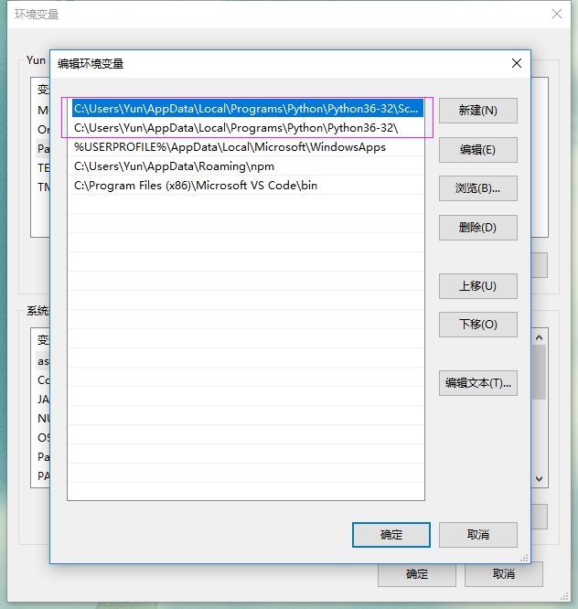
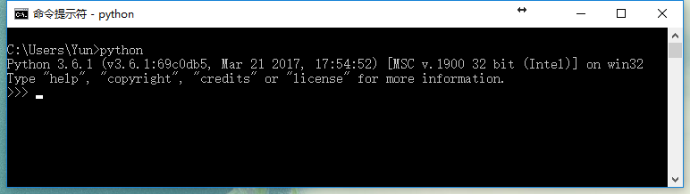

# Windows 安装 Python

1. 下载最新版本的Python。

    Python 下载地址： [https://www.python.org/downloads/](https://www.python.org/downloads/)

2. 按照提示安装Python

3. 检查系统中的 `环境变量` 是否已经被设置正确。

    

    如果系统环境变量没有被正确设置，需要手动将`C:\Users\Yun\AppData\Local\Programs\Python\Python36-32`加入到`Path`中。

    以上的`C:\Users\Yun\AppData\Local\Programs\Python\Python36-32`是我的Python安装路径，请根据自己的实际安装情况填写。

4. 运行命令提示符

    打开命令提示符，输入`python`，如果见到以下界面则表示已经安装成功。

    

# Mac OS 安装 Python

    // TODO

# Linux 安装 Python

    // TODO