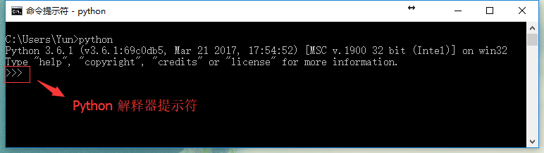
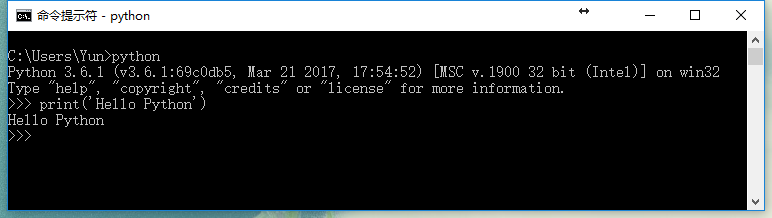
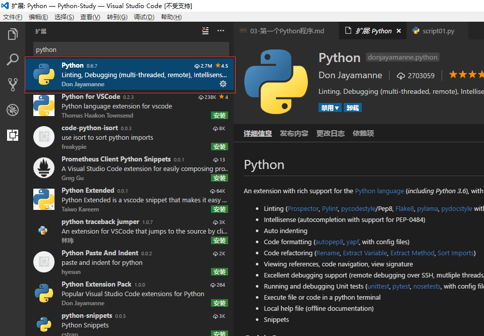
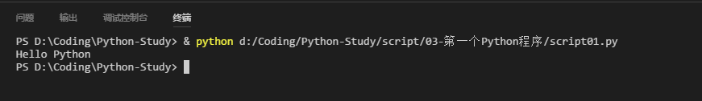

# 运行 Python 程序的两种方式

1. 使用交互式解释器

2. 直接运行一个源代码文件


## 使用交互式解释器

进入 `CMD` ,输入 `python` 打开 `Python提示符(Python Prompt)`。

启动 Python 后在可以输入的地方会显示 `>>>` 。 这个被称为 Python解释器提示符（Python Interpreter Prompt）。



在解释器提示符中输入:


```
print('Hello Python')
```
 
然后按下Enter键将看到在屏幕上打印 `Hello Python` 字样。



## 如何退出解释器提示符

输入 `exit()` 即可退出解释器提示符。

Windows： Ctrl + Z 再按下 Enter

Linux、Mac OS： Ctrl + D 再按下Enter

## 使用IDE

使用一款好的IDE可以帮助我们更好的书写代码和发现代码中的问题，使编程更加得心应手。

推荐使用的IDE有：

* [PyCharm](https://www.jetbrains.com/pycharm-edu/)
* [Vim](http://www.vim.org/)
* [Emacs](http://www.gnu.org/software/emacs/)
* [Visual Stodio Code](https://code.visualstudio.com/Download)

## VSCode Python配置

安装VSCode --> 安装Python插件



创建`script.py`文件

第一次使用的时候可能会提示说 `pylint没有安装` ,我们只需要点击安装即可。

简单介绍一下pylint：

> pylint是一个python代码检查工具，可以帮助python程序员方便地检查程序代码的语法和风格，通过这个工具，可以使你的python代码尽量保持完美。

在编辑器中输入以下代码：

```
"""第一个Python程序"""
# -*- coding: UTF-8 -*-
print('Hello Python')
```

右键 --> Run Python File in Terminal

即可在终端中看到程序运行结果：

